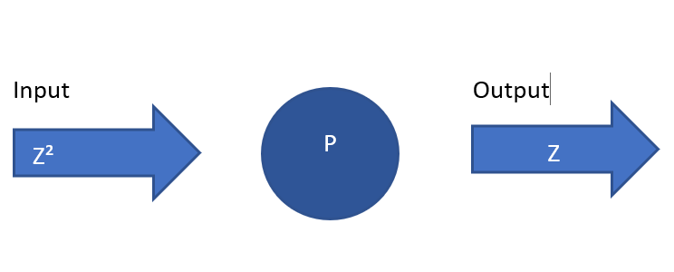

> #### *Adicion*

> - Asignatura: Algoritmos y Estructura de Datos
> - Curso: k1051
> - Año: 2018
> - Cuatrimestre: Primer Cuatrimestre

> - Autor:Cristian Siles
> - Usuario github:cristian308  
> - Legajo:160.529-0
> - Apellido:Siles Rodriguez
> - Nombre:Cristian Samuel
> - Trabajo N°1:Adición
# Análisis del probelma:
> - Transcripción del problema:Obtener del usuario dos números y mostrarle la suma.
> - Refinamiento del problema e Hipótesis de trabajo:
1) Pedir
2) Leer y guardar
3) Pedir 
4) Leer y guardar
5) Mostrar resultado
> - Modelo IPO: 

# Diseño de la Solución:
> - Léxico del Algoritmo: a ∈ Z,b ∈ Z
> - Representación del Algoritmo:
1) Representación visual: Nassi-Shneiderman	(NS)  

| a,b ∈ Z |
| :---: |
| **Leer a** |
| **Leer b** |
| **Mostrar "a+b"** |
