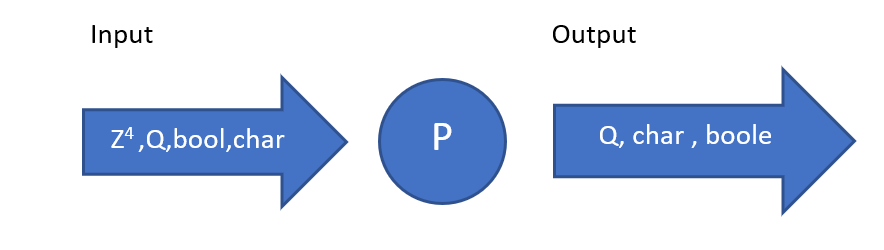

> - Asignatura: Algoritmos y Estructura de Datos
> - Curso: k1051
> - Año: 2019
> - Cuatrimestre: Primer Cuatrimestre

> - Autor: Cristian Siles
> - Usuario github: cristian308  
> - Legajo: 160.529-0
> - Apellido: Siles Rodriguez
> - Nombre: Cristian Samuel
> - Trabajo N°2: Valores y operaciones de tipos de datos

## Problema
Diseñar un programa C++ que ejemplifique la aplicación de los tipos de datos
vistos en clases:

*Diseñar un programa que sume dos numeros y el resultado lo divida por la longitud de una cadena de caracter , tambien el resultado de la division multiplicarlo por el numero 3.1415.
Ademas tambien se pide declarar un caracter de cualquier letra mostrandolo junto con el resultado de la suma y un tipo de dato boleano que sea verdadero.*

# Análisis del probelma:
> - Transcripción del problema:Diseñar un programa que sume dos numeros y el resultado lo divida por la longitud de una cadena de caracter , tambien el resultado de la division multiplicarlo por el numero 3.1415.
Ademas tambien se pide declarar un caracter de cualquier letra mostrandolo junto con el resultado de la suma y un tipo de dato boleano que sea verdadero.
> - Refinamiento del problema e Hipótesis de trabajo:

1)Sumar

2)dividir

3)calcular longitud

4)Multiplicar por 3.1415

5)Mostrar

> - Modelo IPO:

# Diseño de la Solución:
> - Léxico del Algoritmo: suma ∈ Z,longui ∈ Z,b ∈ Z,valor ∈ Z,div ∈ Q

> - Representación del Algoritmo:
*Representación textual en C++:

 #include < iostream >
 
 #include < string.h >

using namespace std;

int suma;

int longi=0;

int b=853;

double div;

char letra= 'z';

bool boleano = true;

unsigned valor=59;

string cadena ="universo";

int main(){

suma= b+valor;

longi=cadena.length();

div= (suma/longi)*3.1415;

cout<<div<<" "<<letra<<" "<<boleano;

}

